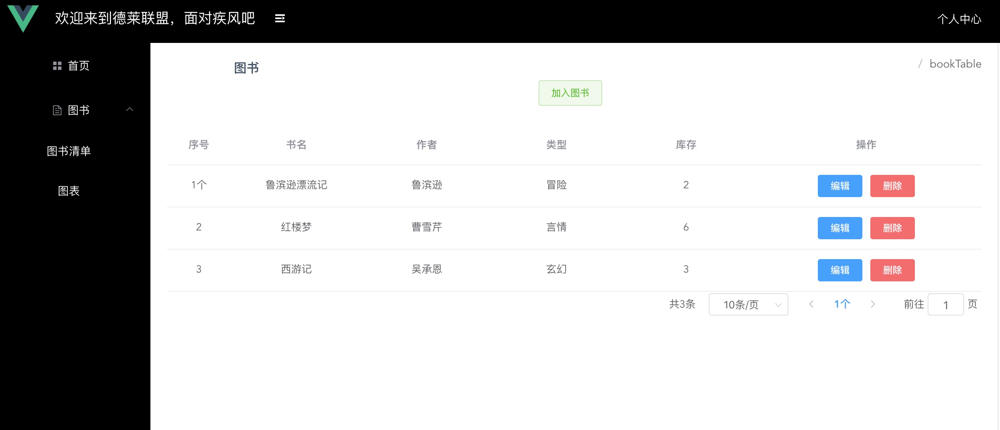

# ts-admin-me


## 技术栈
   vue + typescript + element
<br>


## 参与开发
<br>
更多项目请关注 https://github.com/fanfan1993
<br>


## 页面目录
After creation, your project should look like this:

```
## 页面效果
##### 页面显示





## Project setup
```
npm install
```

### Compiles and hot-reloads for development
```
npm run serve
```

### Compiles and minifies for production
```
npm run build
```

### Customize configuration
See [Configuration Reference](https://cli.vuejs.org/config/).
